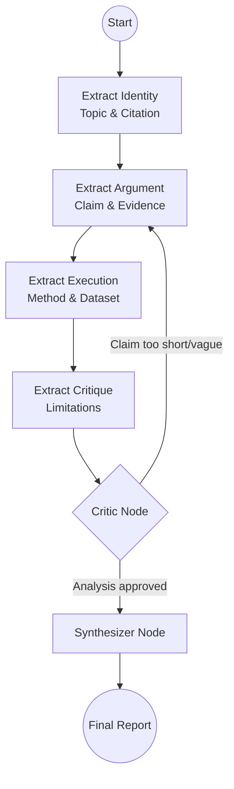

# 🧠 Multimodal Research Intelligence Engine

A powerful, agentic RAG (Retrieval-Augmented Generation) system designed to analyze, compare, and summarize academic research papers with multimodal awareness (text + figures).

## 🚀 Features

### 1. 💬 Interactive Research Chat
- **Multimodal RAG**: Ask questions about your PDF library. The system retrieves both relevant text and figures.
- **Visual Awareness**: Uses a Vision Module (Gemini) to "see" and explain charts, graphs, and diagrams in the context of your query.

### 2. 🔍 Research Gap & Comparison (Agentic)
- **Multi-Paper Analysis**: Upload two papers to find similarities, technical evolution, and improvements.
- **Gap Scouting**: Automatically identifies potential "Scope for New Work" based on the comparison.

### 3. 📄 Paper Overview (Short Notes) [New]
- **LangGraph Architecture**: Uses a non-linear, multi-agent workflow to deeply analyze a single paper.
- **Structured Insights**: Generates a professional summary covering:
    - **Topic & Citation**: Identity extraction.
    - **Core Claim**: A precise 5-6 line thesis statement.
    - **Methodology & Dataset**: Technical execution and data sources.
    - **Limitations**: Critical analysis of the work's constraints.
- **Non-Linear Feedback**: Includes a **Critic Node** that loops back to refine the "Claim" if it doesn't meet the recursive quality standards.

---

## 🏗️ Architecture: Paper Overview (Short Notes)

The "Short Notes" system is built on **LangGraph**, enabling a more robust and "thinking" process than a single LLM prompt.



### Why LangGraph?
1.  **Parallel-Logic Execution**: Instead of one long prompt where the model might miss details, specialized "nodes" focus on specific sections of the paper.
2.  **Self-Correction (Non-Linear)**: The **Critic Node** acts as a quality gate. If the generated "Claim" is too brief or lacks depth, the graph cycles back to the `extract_argument` node with specific feedback for refinement.
3.  **Context Management**: Each node focuses on the most relevant part of the PDF (e.g., Intro for Claim, Results for Evidence, Conclusion for Limitations) to maximize accuracy.

---

## 🛠️ Installation

1. **Clone the repository**:
   ```bash
   git clone <repo-url>
   cd multimodal-research-engine
   ```

2. **Install dependencies**:
   ```bash
   pip install -r requirements.txt
   ```

3. **Set up environment variables**:
   Create a `.env` file:
   ```env
   GEMINI_API_KEY=your_api_key_here
   ```

4. **Run the App**:
   ```bash
   streamlit run app.py
   ```

---

## 📦 Requirements Highlights
- `streamlit`: Ultra-responsive UI.
- `langgraph`: Multi-agent state machine.
- `langchain-google-genai`: Powering the Gemini 2.5 Flash Lite engine.
- `sentence-transformers` & `open_clip_torch`: Multimodal embeddings.
- `faiss-cpu`: High-performance vector storage.
